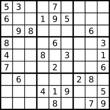
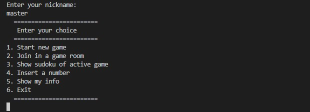

# Sudoku P2P

Progetto accademico di [**Alessandro Oliviero**](https://github.com/aoliviero7)

Corso di Laurea Magistrale in Informatica - Curriculum Cloud Computing: **Architetture distribuite per il Cloud**

Professori: **Alberto Negro**, **Carmine Spagnuolo**, **Gennaro Cordasco**

[Dipartimento di Informatica](http://www.di.unisa.it) - [Università degli Studi di Salerno](https://www.unisa.it/) (Italia)

## Definizione del problema

In questo progetto è stata creata un'implementazione del gioco del sudoku, utilzzando una rete P2P. Ogni utente può piazzare un numero all'interno del sudoku; se non è già piazzato prende 1 punto, se è già piazzato ma è comunque corretto prende 0 punti, in altri casi riceve -1 punto. I sudoku sono basati su una matrice 9 x 9. Tutti gli utenti che giocano ad un sudoku vengono automaticamente informati quando un utente aumenta il proprio punteggio e quando il gioco è terminato. Il sistema consente agli utenti di generare (automaticamente) una nuova sfida Sudoku identificata da un nome, partecipare a una sfida utilizzando un nickname, ottenere la matrice intera che descrive il Sudoku e inserire un numero.



## Soluzione del progetto

Il nucleo principale alla base del progetto è l'utilizzo di una DHT (distributed hash table) che viene usata per poter salvare diverse informazioni come: le stanze di gioco attive al momento, i giocatori di una stanza e i punteggi relativi a ciascun giocatore. 

### SudokuGame

Viene implementata l'interfaccia **SudokuGame** che descrive 4 funzionalità principali:

- Creazione di un nuovo gioco (*generateNewSudoku*), che prevede la realizzazione di una nuova stanza da gioco, identificata dal nome passato come parametro, e la generazione di un nuovo Sudoku;
- Unione ad una partita in corso (*join*), che prevede di prender parte ad una stanza creata da qualche utente in precedenza per poter giocare;
- Ottenere la griglia del Sudoku attuale (*getSudoku*), che prevede di ricevere la matrice del Sudoku della stanza di gioco a cui si appartiene;
- Piazzare un numero all'interno del Sudoku (*placeNumber*), che prevede di inserire un numero all'interno della matrice di gioco attuale, specificandone la posizione.

All'interno della classe **SudokuGameImpl** oltre ai metodi dell'interfaccia, ne sono presenti altri aggiuntivi come: l'invio di un messaggio ai peer della stanza (*sendMessage*), l'aggiunta di un giocatore o del creatore alla dht (*addPlayer* e *addCreator*), il calcolo del vincitore di una partita con le relative operazioni di chiusura (*getWinner*) oppure ancora, la restituzione delle partite in corso o dei giocatori attivi (*roomsActive* e *playersActive*).

### Altre classi

Oltre l'implementazione dell'interfaccia principale sono state create le seguenti classi:

- **Player**: che descrive il singolo giocatore tenendo conto del nickname e del punteggio;
- **Sudoku**: che descrive il sudoku vero e proprio tenendo conto del nome e leggendo da un file json sia la matrice iniziale (con solo alcuni numeri piazzati, mentre il resto è 0) che quella risolta per andare a verificare se i successivi numeri sono corretti o meno;
- **SudokuRoom**: che descrive la stanza da gioco con all'interno un oggetto Sudoku, ed offre anche i metodi di verifica del numero inserito e di correttezza della soluzione;
- **MessageListenerImpl**: che implementa l'interfaccia **MessagelListener** ed offre il metodo *parseMessage*;
- **Game**: che contiene l'interfaccia del programma, sia del menù che del gioco.

Le classi Player, Sudoku e SudokuRoom sono serializzabili in modo da poterne salvare lo stato.

## Interfaccia

All'avvio dell'app viene chiesto all'utente di inserire un nickname, successivamente è possibile scegliere le operazioni da eseguire tramite un menu testuale:



Le funzionalità 1 e 2 sono possibili solo se non si fa già parte di una stanza (avendola creata precedentemente oppure entrando in una esistente).
Le funzionalità 3 e 4 sono possibili solo se si fa parte di una stanza (creandola oppure entrando in una esistente).
La funzionalità 5 mostra all'utente le proprie informazioni quali: ID, nickname e score.

## Docker

**Nota**: Per poter eseguire il programma normalmente è necessario che il valore della variabile **EXECUTION_TYPE** non sia **"TEST"**, all'inizio della classe **Sudoku**, come nel seguente modo:
  
```public final static String EXECUTION_TYPE = " ";```

Viene fornita un'applicazione di esempio utilizzando un Docker container, in esecuzione su una macchina locale. Si veda Dockerfile, per i dettagli di costruzione.

Prima di tutto è possibile costruire il Docker container così:

```docker build --no-cache -t sudoku .```

### Avviare il master peer 

Successivamente è possibile avviare il peer master, in modalità interattiva (-i) e con due variabili di ambiente (-e):

```docker run -i --name MASTER-PEER -e MASTERIP="127.0.0.1" -e ID=0 sudoku```

, la variabile di ambiente MASTERIP è l'indirizzo IP del peer principale e la variabile di ambiente ID è l'ID univoco del peer. Si ricorda che bisogna eseguire il peer master usando l'ID=0.

**Nota**: dopo il primo avvio, è possibile avviare il nodo master utilizzando il comando seguente:
```docker start -i MASTER-PEER```.

### Avviare un peer generico

All'avvio del master bisogna controllare l'indirizzo IP del container:

- Controllare il Docker <ID container>: ```docker ps```
- Controllare l'indirizzo IP: ```docker inspect <container ID>```

Ora puoi è possibile avviare i peer variando l'ID univoco:

```docker run -i --name PEER-1 -e MASTERIP="172.17.0.2" -e ID=1 sudoku```

**Nota**: dopo il primo avvio, è possibile avviare questo nodo peer utilizzando il comando seguente:
```docker start -i PEER-1```.

  
## Test
  
**Nota**: Per poter effettuare i test è necessario che il valore della variabile **EXECUTION_TYPE** sia **"TEST"**, all'inizio della classe **Sudoku**:
  
```public final static String EXECUTION_TYPE = "TEST";```
  
I test sono stati eseguiti con junit e sono state testate tutte le funzionalità descritte dalla classe **SudokuGameImpl**
